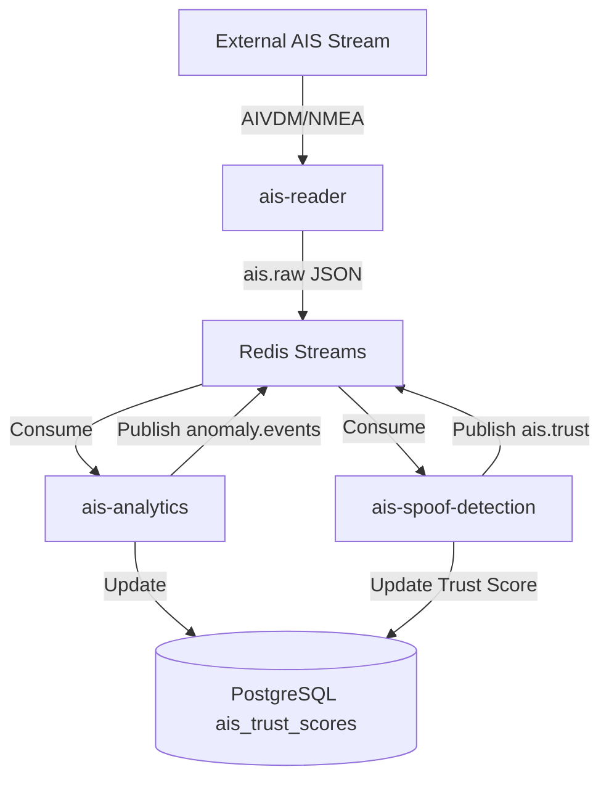

# AIS Processing Pipeline

The Aqua-Sentinel AIS processing pipeline is responsible for ingesting, analyzing, and verifying Automatic Identification System (AIS) data from maritime vessels. The pipeline is distributed across three microservices, communicating asynchronously via Redis Streams.

## 1. AIS Reader (`ais-reader`)
**Purpose**: Ingests live AIS streams, decodes NMEA/AIVDM sentences, and normalizes the data into a standard JSON format.

**Key Responsibilities**:
- Connects to external AIS data providers (e.g., Norwegian Coastal Administration, AISHub) via WebSocket or TCP streams.
- Decodes Type 1/2/3 (position reports) and Type 5 (static voyage data).
- Performs initial sanity checks and coordinate normalization.
- Publishes the structured `ais.raw` stream to Redis.

## 2. AIS Analytics (`ais-analytics`)
**Purpose**: Maintains vessel state, computes trajectory analytics, and detects basic operational anomalies.

**Key Responsibilities**:
- Consumes `ais.raw` using Redis Consumer Groups.
- Computes real-time trajectory metrics (speed over ground, course variations).
- Detects **AIS Gaps (Dark Vessels)** by tracking the time since the last seen ping. If a vessel hasn't reported within `AIS_GAP_THRESHOLD_MINUTES`, it flags an anomaly.
- Identifies **Loitering** and **Erratic Course** behaviors based on localized movement patterns.
- Writes cleaned and aggregated vessel states to the PostgreSQL `vessels` table.

## 3. AIS Spoof Detection (`ais-spoof-detection`)
**Purpose**: Calculates a dynamic trust score for every vessel to identify potential GPS spoofing, MMSI cloning, or manipulated data.

**Key Responsibilities**:
- Evaluates five key trust factors:
  1. **Dead Reckoning Check**: Compares the reported position against the physically expected position (based on previous speed/course).
  2. **Speed Jump Validation**: Flags physically impossible speeds (e.g., > 25.7 m/s / 50 knots) between consecutive pings.
  3. **MMSI Collision**: Detects phantom or cloned MMSIs where a single vessel ID reports geographically incompatible positions simultaneously.
  4. **Identity Consistency**: Flags sudden changes in vessel name or type for the same MMSI.
  5. **MMSI Validity**: Checks the checksum and country code prefix (MID) of the MMSI.
- Combines these into an **Instant Trust Score**.
- Updates an Exponential Moving Average (EMA) **Rolling Trust Score** in Redis.
- Drops the rolling trust below `SPOOFING_TRUST_THRESHOLD`, it raises a `spoofing_suspected` flag for the vessel risk engine.

## Architecture & Data Flow

