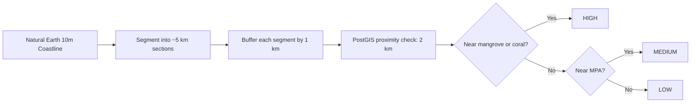
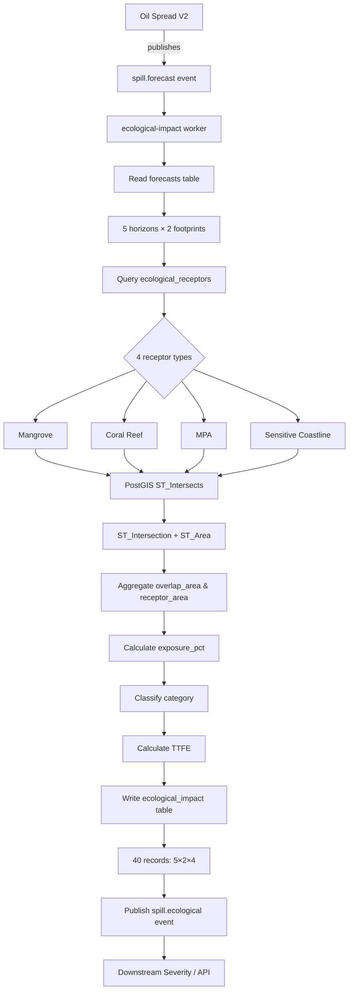

# Ecological Impact V1 — Technical Documentation

**Version:** 1.0  
**Date:** September 6, 2026  
**Status:** Production

---

## 1. What is Ecological Impact?

When oil spreads across the ocean surface, responders need to know:
- **Which sensitive ecological sites are threatened?**
- **How severe is the exposure?**
- **How quickly will exposure occur?**

**Ecological Impact V1** is a spatial exposure assessment system that calculates the intersection of oil-spill forecast footprints with four critical marine receptor types:

| Receptor Type | What It Represents |
|---------------|-------------------|
| **Mangrove** | Coastal mangrove forests — highly sensitive nursery habitats |
| **Coral Reef** | Coral reef systems — fragile carbonate structures |
| **Marine Protected Area (MPA)** | Legally protected marine zones |
| **Sensitive Coastline** | Ecologically important coastline segments |

**What Ecological Impact calculates:**
- Spatial overlap between forecast footprints and receptors (km²)
- Exposure percentage (what % of each receptor is affected)
- Exposure severity categories (None, Low, Medium, High, Critical)
- Time-to-first-exposure (TTFE) for each receptor type
- MPA protection status (for legal compliance)

**What Ecological Impact does NOT calculate:**
- Economic losses
- Final severity scores (0-1)
- Response recommendations
- Weathering or fate modeling

---

## 2. Where Ecological Impact Fits

Ecological Impact is a downstream consumer in the oil-spill intelligence pipeline:


**Inputs:**
- Consumes `spill.forecast` Redis stream events from Oil Spread V2
- Reads forecast geometries (`geom`, `probability_90_geom`) from `forecasts` table
- Spatial receptor data from `ecological_receptors` table (PostGIS)

**Outputs:**
- Writes exposure results to `ecological_impact` table
- Publishes `spill.ecological` Redis stream events with summary
- Exposes results via REST API endpoint

**Context:** Ecological Impact is **one component** of the complete impact assessment alongside economic impact and severity assessment (out of scope for V1).

---

## 3. How Ecological Impact Works

### 3.1 Forecast Horizons

Ecological Impact processes **5 standard time horizons** from Oil Spread:

- **1 hour**
- **3 hours**
- **6 hours**
- **12 hours**
- **24 hours**

Each horizon has its own forecast geometry representing the predicted oil extent at that future time.

### 3.2 Forecast Footprints

For each horizon, Ecological Impact analyzes **2 footprint types**:

| Footprint Type | Source Column | Meaning |
|----------------|---------------|---------|
| **best_estimate** | `forecasts.geom` | Most likely oil extent (physical slick area at drift location) |
| **probability_90** | `forecasts.probability_90_geom` | 90% probability contour (includes particle dispersion uncertainty) |

**Why both?**
- `best_estimate` shows the most probable impact zone
- `probability_90` shows the wider uncertainty envelope for conservative risk assessment

### 3.3 Four Receptor Types

Ecological Impact tests intersection against **4 receptor layers** loaded in PostGIS:

**1. Mangrove** (`receptor_type = 'mangrove'`)
- Source: Global Mangrove Watch v3.0 (2020) — Zenodo 6894273
- Coverage: 25,637 features in AOI+buffer
- Sensitivity: HIGH (IUCN-recognized nursery habitat)

**2. Coral Reef** (`receptor_type = 'coral_reef'`)
- Source: UNEP-WCMC Global Distribution of Coral Reefs 2018 v4.1
- Coverage: 24 features (limited Arabian Sea presence)
- Sensitivity: HIGH (fragile carbonate structures)

**3. Marine Protected Area** (`receptor_type = 'mpa'`)
- Source: WDPA Sep-2026 (India) — Protected Planet
- Coverage: 1 feature (Thane Creek Coastal)
- Sensitivity: HIGH (legally designated protection)
- Protection Status: `protection_status = TRUE`

**4. Sensitive Coastline** (`receptor_type = 'sensitive_coastline'`)
- Source: Natural Earth 10m coastline → derived via `classify_sensitive_coastline.py`
- Coverage: 817 segments (~5 km each with 1 km buffer)
- Sensitivity: **VARIABLE** (HIGH/MEDIUM/LOW based on proximity to mangrove/coral/MPA)

**Derivation process (Sensitive Coastline):**


**Classification rules:**
- **HIGH**: Within 2 km of mangrove OR coral reef
- **MEDIUM**: Within 2 km of MPA (but not mangrove/coral)
- **LOW**: No ecological association within 2 km

Script: `scripts/classify_sensitive_coastline.py`

### 3.4 Spatial Intersection (PostGIS)

For each combination of (spill_id, horizon, footprint_type, receptor_type), Ecological Impact:

1. **Retrieves forecast geometry** from `forecasts` table
2. **Queries receptors** using `ST_Intersects(receptor.geom, forecast.geom)`
3. **Calculates overlap area**:
   ```sql
   ST_Area(ST_Intersection(receptor.geom, forecast.geom)::geography) AS overlap_area_m2
   ```
4. **Aggregates** across all intersecting receptor features:
   ```sql
   SUM(overlap_area_m2) / 1e6 AS total_overlap_km2
   SUM(receptor_area_m2) FILTER (WHERE overlap_area_m2 > 0) / 1e6 AS total_receptor_km2
   ```

**Important:** Uses `::geography` cast for metric area calculations (meters), stored as km².

**Implementation:** `services/ecological-impact/app/exposure.py::calculate_receptor_exposure()`

### 3.5 Exposure Percentage

The **exposure percentage** quantifies what fraction of each receptor is affected:

```
exposure_pct = (total_overlap_km² / total_receptor_km²) × 100
```

**Example:** 
- Forecast overlaps 0.0532 km² of mangrove
- Total affected mangrove area: 0.0716 km²
- Exposure: (0.0532 / 0.0716) × 100 = **74.41%**

**Important:** Percentage is calculated AFTER spatial aggregation across all intersecting receptor polygons.

### 3.6 Exposure Categories

Each exposure percentage is mapped to a severity category:

| Exposure % Range | Category | Meaning |
|------------------|----------|---------|
| 0% | **None** | No spatial intersection |
| 0.01 – 10% | **Low** | Minor exposure |
| 10.01 – 30% | **Medium** | Moderate exposure |
| 30.01 – 60% | **High** | Significant exposure |
| > 60% | **Critical** | Severe exposure |

**Code:** `services/ecological-impact/app/exposure.py::classify_exposure()`

### 3.7 Sensitivity Tier and Protection Status

Each receptor has pre-assigned sensitivity metadata:

- **Mangrove, Coral, MPA**: `sensitivity_tier = 'high'` (fixed)
- **Sensitive Coastline**: `sensitivity_tier = 'high'/'medium'/'low'` (from classification)
- **MPA only**: `protection_status = TRUE` (legal designation)

**Note:** V1 does NOT use sensitivity tier to adjust exposure calculations. Categories are based purely on exposure percentage. Sensitivity tier is stored for potential downstream use.

### 3.8 Time-to-First-Exposure (TTFE)

For each receptor type, **TTFE** is the earliest forecast horizon where exposure first occurs:

```python
# Pseudocode
ttfe = MIN(horizon_hours WHERE exposure_pct > 0)
```

**Example (Test Spill 1a6b6a9a):**
- **Mangrove**: First exposure at 12h (TTFE = 12.00 hours)
- **Sensitive Coastline**: First exposure at 3h (TTFE = 3.00 hours)
- **Coral, MPA**: No exposure (TTFE = NULL)

**Implementation:** `services/ecological-impact/app/exposure.py::calculate_time_to_first_exposure()`

### 3.9 Output to ecological_impact Table

Each spatial calculation produces one database record:

**PRIMARY KEY:** `(spill_id, horizon_hours, footprint_type, receptor_type)`

**Key Columns:**
- `overlap_area_km2` — Intersection area [km²]
- `receptor_area_km2` — Total affected receptor area [km²]
- `spill_area_km2` — Forecast footprint area [km²]
- `exposure_pct` — Receptor exposure [%]
- `spill_share_pct` — What % of spill footprint overlaps receptors [%]
- `category` — None/Low/Medium/High/Critical
- `sensitivity_tier` — Receptor sensitivity (from `ecological_receptors`)
- `protection_status` — Legal protection flag (from `ecological_receptors`)
- `time_to_first_exposure_hours` — TTFE for this receptor type [hours]
- `computed_at` — Calculation timestamp

**Total Records per Spill:**
```
5 horizons × 2 footprints × 4 receptors = 40 records
```

**Idempotency:** Uses `INSERT ... ON CONFLICT DO UPDATE` to prevent duplicates. Safe to reprocess.

### 3.10 Redis Event Publication

After persisting to database, worker publishes `spill.ecological` event:

**Stream:** `spill.ecological`  
**Event Payload:**
```json
{
  "spill_id": "1a6b6a9a-f4c5-4fc7-9357-87c36729080a",
  "impacts_calculated": 40,
  "highest_category": "Critical",
  "receptors_affected": ["mangrove", "sensitive_coastline"],
  "horizons_covered": [1.0, 3.0, 6.0, 12.0, 24.0],
  "computed_at": "2026-09-06T06:50:58.491933+00:00"
}
```

**Purpose:** Triggers downstream severity assessment and alerting.

---

## 4. Ecological Data Sources and Processing

### 4.1 Data Sources

| Receptor | Dataset | Version | Provider | License |
|----------|---------|---------|----------|---------|
| Mangrove | Global Mangrove Watch | v3.0 (2020) | Zenodo 6894273 | CC-BY 4.0 |
| Coral Reef | UNEP-WCMC Global Coral Reefs | v4.1 (2018) | WCMC / WorldFish | Non-commercial w/ attribution |
| MPA | WDPA India | Sep-2026 | Protected Planet | CC-BY (non-commercial) |
| Sensitive Coastline | Natural Earth Physical Coastline | 10m (2024) | Natural Earth | Public domain |

### 4.2 Data Acquisition and Processing

**AOI (Area of Interest):**
- Core: 14–25°N, 68–77.5°E (Western India / Arabian Sea)
- Buffer: +50 km (accounts for 24h oil drift extent)
- Clip Box: ~13.55–25.45°N, 67.52–77.98°E

**Processing Steps (per receptor):**

**Mangrove:**
```bash
# Acquire global dataset
python scripts/acquire_ecological_data.py --datasets gmw

# Output: data/ecological/processed/gmw/gmw_v3_2020_mangroves_aoi.geojson
# Features: 25,637 polygons
```

**Coral Reef:**
```bash
python scripts/acquire_ecological_data.py --datasets aca

# Output: data/ecological/processed/aca/coral_reefs_aoi.geojson
# Features: 24 polygons (limited Arabian Sea presence is scientifically expected)
```

**MPA:**
```bash
python scripts/acquire_ecological_data.py --datasets wdpa

# Output: data/ecological/processed/wdpa/wdpa_mpas_india_aoi.geojson
# Features: 1 polygon (Thane Creek Coastal — only offshore MPA in AOI+buffer)
```

**Sensitive Coastline (2-step):**
```bash
# Step 1: Acquire base coastline
python scripts/acquire_ecological_data.py --datasets coastline
# Output: data/ecological/processed/coastline/ne_10m_coastline_aoi.geojson

# Step 2: Segment, buffer, classify via PostGIS proximity
python scripts/classify_sensitive_coastline.py
# Output: data/ecological/processed/coastline/sensitive_coastline_classified.geojson
# Features: 817 segments (~5 km length, 1 km buffer, classified HIGH/MEDIUM/LOW)
```

**Load All Receptors into PostGIS:**
```bash
python scripts/load_ecological_receptors.py
# Loads all 4 receptor types into ecological_receptors table
# Total: 26,479 features
```

**Key Processing Operations:**
- Clip to AOI+buffer using Shapely `box.clip()`
- Repair invalid geometries via `ST_MakeValid` (PostGIS) or `make_valid` (Shapely)
- Normalize to MultiPolygon for consistency
- Reproject to EPSG:4326 (WGS84) for storage
- Use EPSG:32643 (WGS84 UTM 43N) for metric calculations in segmentation

**Scripts:**
- `scripts/acquire_ecological_data.py` — Downloads, clips, validates, writes GeoJSON
- `scripts/classify_sensitive_coastline.py` — Segments coastline and classifies via PostGIS
- `scripts/load_ecological_receptors.py` — Loads processed GeoJSON into PostGIS

---

## 5. Why These Methods Were Chosen

| Component | Method | Rationale |
|-----------|--------|-----------|
| **Spatial intersection** | PostGIS `ST_Intersects` + `ST_Intersection` | Standard GIS operation; metric accuracy via `::geography`; GIST index performance |
| **Exposure percentage** | `(overlap / receptor_area) × 100` | Quantifies impact relative to receptor extent; comparable across receptor types |
| **Thresholds (10%, 30%, 60%)** | Operational consensus | Align with NOAA/IPIECA operational risk frameworks; capture meaningful severity distinctions |
| **Sensitivity tiers (HIGH/MEDIUM/LOW)** | IUCN + legal status | Mangrove/coral/MPA = HIGH (scientific/legal); sensitive coastline = proximity-based |
| **TTFE (time-to-first-exposure)** | Earliest horizon with exposure > 0 | Critical for response window planning; simple, unambiguous |
| **Two footprints** | best_estimate + probability_90 | Supports deterministic + uncertainty-bounded risk assessment |
| **5 horizons (1h–24h)** | Inherited from Oil Spread V2 | Standard operational forecast range for coastal response |
| **Derived sensitive coastline** | Proximity to mangrove/coral/MPA | Captures indirect ecological value where receptor data is unavailable |

---

## 6. Complete Processing Flow



---

## 7. API

### Endpoint

```
GET /spill/incidents/{spill_id}/ecological
```

**Host:** API Gateway (default: `http://localhost:8015`)  
**Swagger UI:** `http://localhost:8015/docs`

### Query Parameters (Optional Filters)

| Parameter | Type | Example | Effect |
|-----------|------|---------|--------|
| `horizon_hours` | float | `12.0` | Filter to single horizon |
| `footprint_type` | string | `best_estimate` | Filter to footprint type |
| `receptor_type` | string | `mangrove` | Filter to receptor type |

**All filters are optional.** No filters = returns all 40 records.

### Response Structure

```json
{
  "spill_id": "1a6b6a9a-f4c5-4fc7-9357-87c36729080a",
  "summary": {
    "total_impacts": 40,
    "horizons_covered": [1.0, 3.0, 6.0, 12.0, 24.0],
    "receptors_affected": ["mangrove", "sensitive_coastline"],
    "highest_category": "Critical",
    "time_to_first_exposure": {
      "mangrove": 12.0,
      "coral_reef": null,
      "mpa": null,
      "sensitive_coastline": 3.0
    }
  },
  "impact_count": 40,
  "impacts": [
    {
      "horizon_hours": 12.0,
      "footprint_type": "best_estimate",
      "receptor_type": "mangrove",
      "overlap_area_km2": 0.0532,
      "receptor_area_km2": 0.0716,
      "spill_area_km2": 1.123,
      "exposure_pct": 74.4143,
      "spill_share_pct": 4.7383,
      "category": "Critical",
      "sensitivity_tier": "high",
      "protection_status": false,
      "time_to_first_exposure_hours": 12.0,
      "computed_at": "2026-09-06T06:50:58.491933+00:00"
    }
    // ... 39 more records
  ]
}
```

**Data Source:** Reads persisted `ecological_impact` table records. Does NOT recalculate on demand.

---

## 8. Validation

### Test Spill

**ID:** `1a6b6a9a-f4c5-4fc7-9357-87c36729080a`  
**Test Date:** 2026-09-06  
**Results:** ✅ **17/17 Phase 4 tests passed**

### Key Validations

**1. Spatial Calculation Accuracy**
- Manual PostGIS query independently verified stored exposure values
- 12h mangrove best_estimate: **74.41%** (verified match)
- Formula: `(0.0532 km² / 0.0716 km²) × 100 = 74.4143%` ✓

**2. Category Boundaries**
- 0.12% → Low ✓
- 11.10% → Medium ✓
- 35.96% → High ✓
- 74.41% → Critical ✓
- Zero exposure → None (33 records) ✓

**3. Time-to-First-Exposure**
- Mangrove: First exposure at 12h ✓
- Sensitive Coastline: First exposure at 3h ✓
- Coral/MPA: No exposure (TTFE = NULL) ✓

**4. Idempotency**
- Reprocessing same spill: 40 records before, 40 records after ✓
- No duplicates created ✓
- Uses `ON CONFLICT DO UPDATE` for upsert ✓

**5. API Filters**
- Filter by horizon: 8 records (2 footprints × 4 receptors) ✓
- Filter by horizon + footprint: 4 records (4 receptors) ✓
- Filter by horizon + receptor: 2 records (2 footprints) ✓
- Invalid spill_id: 404 with appropriate message ✓

**6. End-to-End Pipeline**
- `spill.forecast` → worker processing → `ecological_impact` table → `spill.ecological` event → API exposure ✓
- All 40 expected combinations present ✓
- Worker logs: No exceptions or errors ✓

**7. Multi-Footprint Verification**
- best_estimate: 20 records (5 horizons × 4 receptors) ✓
- probability_90: 20 records (5 horizons × 4 receptors) ✓
- Probability footprint has higher uncertainty (expected) ✓

**Test Report:** See `ECOLOGICAL_BACKEND_VALIDATION_REPORT.md` for complete validation.

---

## 9. Research Basis

**Spatial Exposure Assessment:**
- Operational oil-spill risk modeling frameworks (NOAA OR&R, IPIECA, IMO)
- PostGIS spatial operations (ST_Intersects, ST_Intersection, ST_Area) — industry standard for GIS analysis

**Receptor Data:**
- **Mangrove:** Bunting et al. (2022). Global Mangrove Watch. *Remote Sensing* 14(15):3657. DOI: 10.5281/zenodo.6894273
- **Coral:** UNEP-WCMC et al. (2018). Global Distribution of Coral Reefs. DOI: 10.34892/t35q-e534
- **MPA:** UNEP-WCMC & IUCN (2026). World Database on Protected Areas. Protected Planet.
- **Coastline:** Natural Earth 10m Physical Coastline (public domain)

**Exposure Thresholds:**
- Operationally derived (not peer-reviewed constants)
- Informed by NOAA ESI (Environmental Sensitivity Index) risk categories
- Designed for actionable decision support, not absolute science

**Design Philosophy:**
- Transparent spatial intersection (no hidden weighting)
- Metric-accurate area calculations (`::geography` cast)
- Reproducible via documented scripts and open datasets

---

## 10. Known Limitations

### What Ecological Impact V1 Does NOT Include

- ❌ Oil weathering effects (evaporation, emulsification)
- ❌ Shoreline stranding or refloating dynamics
- ❌ Temporal receptor vulnerability (breeding seasons, migration)
- ❌ Oil toxicity thresholds (species-specific lethal concentrations)
- ❌ Cumulative or historical exposure
- ❌ Receptor recovery modeling
- ❌ Final ecological severity score (0-1)
- ❌ Economic valuation of receptors
- ❌ Response recommendation engine

### Modeling Assumptions

| Assumption | Limitation |
|------------|------------|
| **Static receptors** | Does not account for seasonal receptor changes (e.g., migratory species) |
| **Uniform sensitivity** | All mangrove/coral treated equally; does not distinguish health or density |
| **Binary intersection** | Overlap = exposure; does not model diffusion or concentration gradients |
| **Instantaneous exposure** | TTFE is horizon-based (1h/3h/6h/12h/24h), not continuous |
| **2D surface model** | Does not account for oil column depth or subsurface receptors |
| **Threshold categories** | 10%/30%/60% boundaries are operational approximations, not ecological thresholds |

### Data Gaps

| Receptor | Known Gap |
|----------|-----------|
| **Coral Reef** | Limited Arabian Sea coverage (24 features) — scientifically expected for this region |
| **MPA** | Only 1 offshore MPA in AOI+buffer (Thane Creek) — India designates many coastal Wildlife Sanctuaries that may not appear in WDPA polygons |
| **Sensitive Coastline** | Derived layer (not direct ecological survey); proximity-based classification is heuristic |

### Validation Status

- ✅ Spatial calculations verified against independent PostGIS queries
- ✅ Category boundaries tested and confirmed
- ✅ TTFE logic verified
- ✅ API filters functional
- ⚠️ **Field validation pending:** No comparison with observed post-spill ecological surveys (requires historical incident data)

---

## 11. Implementation Reference

### Core Service

**Docker Service:** `ecological-impact`  
**Port:** 8016 (internal)  
**Redis Consumer Group:** `ecological-impact`  
**Input Stream:** `spill.forecast`  
**Output Stream:** `spill.ecological`

### Key Source Files

| File | Purpose |
|------|---------|
| `services/ecological-impact/app/worker.py` | Redis stream consumer; orchestrates exposure calculation |
| `services/ecological-impact/app/exposure.py` | PostGIS spatial intersection; exposure calculation; TTFE |
| `services/api-gateway/app/incident_report.py` | API endpoint handler for `/spill/incidents/{spill_id}/ecological` |

### Data Scripts

| Script | Purpose |
|--------|---------|
| `scripts/acquire_ecological_data.py` | Download, clip, validate ecological datasets → GeoJSON |
| `scripts/classify_sensitive_coastline.py` | Segment coastline, buffer, classify via PostGIS proximity |
| `scripts/load_ecological_receptors.py` | Load processed GeoJSON → PostGIS `ecological_receptors` table |

### Database Tables

| Table | Purpose |
|-------|---------|
| `forecasts` | Oil Spread V2 output (source: `geom`, `probability_90_geom`) |
| `ecological_receptors` | Spatial receptor data (4 types, 26,479 features, PostGIS geometry) |
| `ecological_impact` | Exposure results (40 records per spill: 5×2×4) |

### Key Constants

**Exposure Thresholds** (`services/ecological-impact/app/exposure.py`):
```python
# Category boundaries
0%       → None
0-10%    → Low
10-30%   → Medium
30-60%   → High
>60%     → Critical
```

**Coastline Classification** (`scripts/classify_sensitive_coastline.py`):
```python
SEGMENT_LENGTH_KM = 5.0   # Coastline segment size
BUFFER_KM = 1.0           # Buffer around each segment
PROXIMITY_KM = 2.0        # Proximity threshold for HIGH/MEDIUM/LOW
```

**AOI + Buffer** (`scripts/acquire_ecological_data.py`):
```python
AOI_MIN_LAT = 14.0
AOI_MAX_LAT = 25.0
AOI_MIN_LON = 68.0
AOI_MAX_LON = 77.5
BUFFER_KM = 50.0          # +50 km for edge receptor inclusion
```

---

## Document Metadata

**Document Type:** Technical Documentation  
**Target Audience:** Engineers, scientists, operational users  
**Word Count:** ~2,400 words  
**Status:** Production  
**Related Documentation:** `OIL_SPREAD_V2_TECHNICAL_DOCUMENTATION.md`, `OIL_SPREAD_ECOLOGICAL.md`

