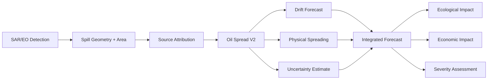
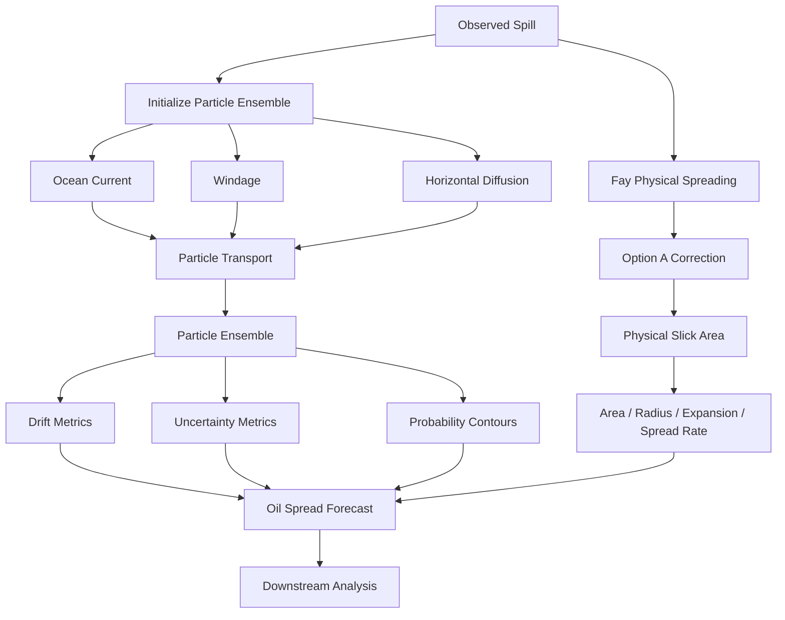
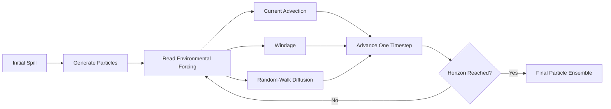
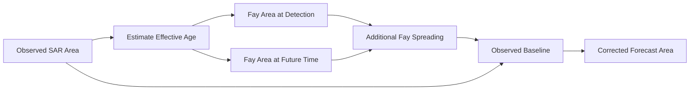
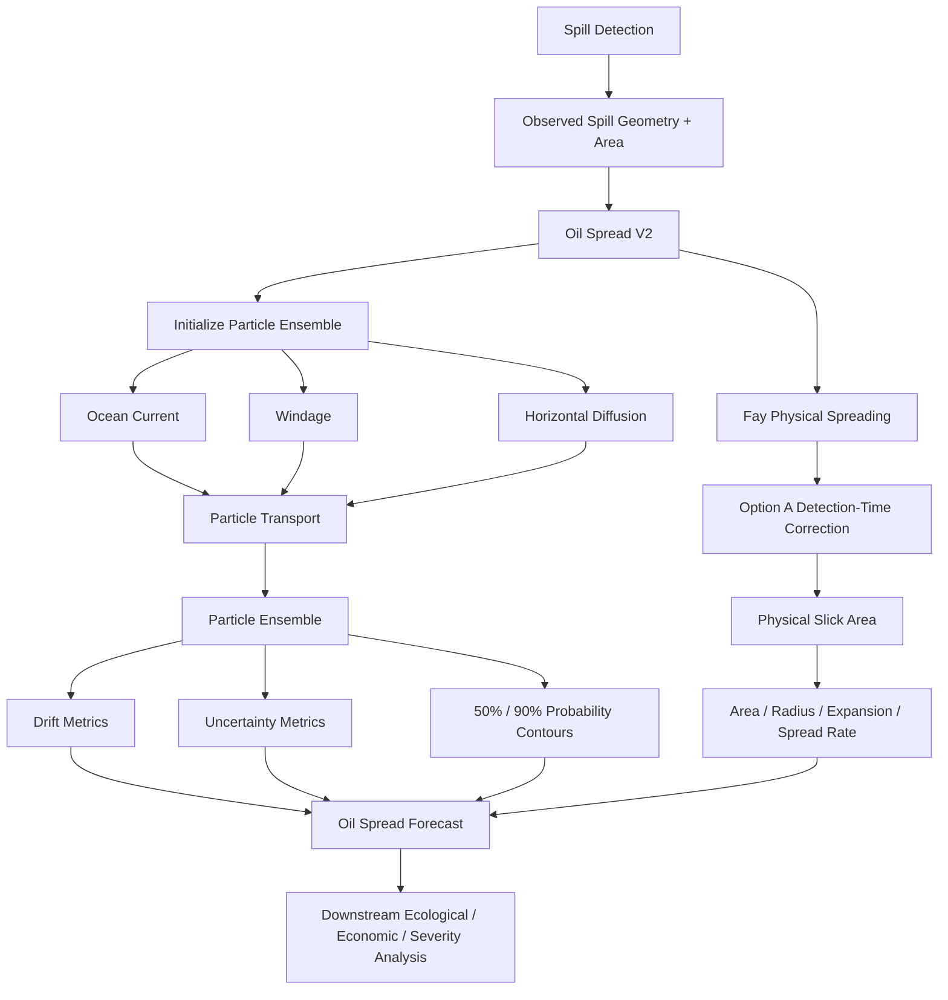

# Oil Spread V2 — Technical Documentation

**Version:** 2.0-separated-physics  
**Date:** September 5, 2026  
**Status:** Production

---

## 1. What is Oil Spread?

When an oil spill is detected on the ocean surface through satellite imagery (SAR/EO), detection alone is insufficient for response planning. Responders need to know:
- Where will the oil move?
- How will the spill's physical extent change over time?
- What is the uncertainty in these predictions?

**Oil Spread V2** is a Lagrangian particle-based forecasting system that predicts oil spill evolution by explicitly modeling three distinct physical phenomena:

### 1.1 Three Separate Concepts

| Concept | Physical Meaning | What It Represents |
|---------|------------------|-------------------|
| **Drift** | Bulk transport of the slick | *Where* the oil moves (ocean currents + wind) |
| **Physical Spreading** | Gravity-viscous slick expansion | *How* the oil area grows due to its physical properties |
| **Uncertainty** | Ensemble dispersion | *How confident* we are in the forecast |

**Critical distinction:** These are **NOT** the same thing:
- **Drift** changes the slick's *position*
- **Physical spreading** changes the slick's *area*
- **Uncertainty** represents forecast *reliability*

Oil Spread V2 separates these phenomena explicitly, unlike earlier models that conflated them.

---

## 2. Where Oil Spread Fits in the System

Oil Spread is a forecast component in a larger oil-spill detection and assessment pipeline:



**What Oil Spread DOES:**
- Consumes spill location, geometry, area, and detection time
- Ingests environmental forcing (ocean currents, wind)
- Generates spatial and temporal forecasts at multiple time horizons
- Produces drift, physical spreading, and uncertainty metrics

**What Oil Spread DOES NOT do:**
- SAR/EO spill detection
- Source attribution
- Ecological or economic impact scoring
- Final severity assessment

---

## 3. Inputs to Oil Spread V2

### 3.1 Spill Information

| Input | Description | Units |
|-------|-------------|-------|
| `spill_lat`, `spill_lon` | Detected spill centroid | degrees |
| `observation_time` | Detection timestamp (UTC) | datetime |
| `spill_geometry` | Spill polygon boundary | WKT/GeoJSON |
| `observed_area` | SAR-detected spill area | m² |

**Why required:** Provides the initial condition for the forecast model.

### 3.2 Environmental Forcing

| Input | Description | Units |
|-------|-------------|-------|
| `current_speed_ms` | Ocean surface current speed | m/s |
| `current_dir_deg` | Current direction (from North) | degrees |
| `wind_speed_ms` | Wind speed | m/s |
| `wind_dir_deg` | Wind direction (from North) | degrees |
| `forcing_series` | Time series of forcing over forecast horizon | time-indexed |

**Why required:** Ocean currents and wind drive the transport (drift) of the oil slick. Time-varying forcing accounts for changing environmental conditions.

### 3.3 Oil Properties

| Property | Default | Units | Role |
|----------|---------|-------|------|
| `oil_density` | 900 | kg/m³ | Buoyancy, spreading rate |
| `oil_viscosity` | 0.00001 | m²/s | Resistance to spreading |
| `interfacial_tension` | 0.03 | N/m | Oil-water interface energy |
| `water_density` | 1025 | kg/m³ | Reference density (seawater) |
| `initial_thickness` | 0.0001 | m | Volume estimation (0.1 mm) |

**Why required:** Physical spreading depends on oil properties. Defaults are generic medium crude approximations used when incident-specific data is unavailable.

**Important:** Thickness cannot be measured from SAR and must be assumed, introducing significant volume uncertainty.

---

## 4. Overall Architecture

Oil Spread V2 deliberately separates movement, spreading, and uncertainty into independent calculation streams:



**Architecture principles:**
- **Separation of physics:** Drift, spreading, and uncertainty computed independently
- **Lagrangian transport:** Particle ensemble represents spatially distributed movement
- **Probabilistic uncertainty:** Ensemble spread quantifies forecast reliability
- **Option A correction:** Aligns Fay physics with operational detection-time reference

---

## 5. Lagrangian Particle Model

Oil Spread V2 uses a **Lagrangian particle ensemble** to represent the oil slick:

**What is a Lagrangian particle model?**
- The slick is discretized into **N particles** (default: **500 particles**)
- Each particle moves through the environmental flow field
- Particles experience slightly different windage coefficients
- Random diffusion introduces horizontal dispersion
- The resulting particle cloud represents possible future slick locations

**Integration:**
- **Timestep:** 600 seconds (10 minutes)
- **Method:** Forward Euler integration with stochastic diffusion



---

## 6. Drift

**Drift** represents the bulk movement of the oil slick due to environmental forcing.

### 6.1 Drift Formulation

The velocity of each particle is:

```
v_drift = v_current + α(p) R(θ) v_wind
```

Where:
- `v_drift` = total particle velocity [m/s]
- `v_current` = ocean surface current velocity [m/s]
- `v_wind` = wind velocity [m/s]
- `α(p)` = windage coefficient for particle `p` [dimensionless]
- `R(θ)` = optional wind deflection rotation by angle `θ` [degrees]

### 6.2 Components

**Ocean Current:**
- Primary transport mechanism
- Applied at 100% (full advection)
- Spatially interpolated from forcing grid

**Windage:**
- Represents wind-driven surface drift
- Configured range: **1–4%** of wind speed (default)
- Sampled per particle to represent uncertainty
- **Resampled every 15 minutes** (900 seconds)

**Why windage varies:** Wind-drift coefficient depends on oil type, slick thickness, wind speed, and sea state. Operational models use a range to capture this uncertainty.

**Wind Deflection (Optional):**
- **Default state:** DISABLED
- Configurable angle: 20° (if enabled)
- Represents Ekman/Coriolis deflection

**Important:** Wind deflection magnitude is NOT universal. It varies with latitude, wind duration, and stratification. The 20° value is a configurable engineering parameter, not a physical constant.

---

## 7. Horizontal Diffusion and Uncertainty

### 7.1 Random-Walk Diffusion

Unresolved sub-grid turbulent dispersion is represented by a Fickian random walk:

```
σ = √(2 Kₕ Δt)
```

Where:
- `σ` = diffusion displacement scale per timestep [m]
- `Kₕ` = horizontal diffusivity [m²/s]
- `Δt` = integration timestep [s]

**Current implementation:**
- `Kₕ` = **10 m²/s** (default)
- `Δt` = 600 s (10 minutes)

At each timestep, each particle receives a random displacement:

```
dx = N(0, σ)
dy = N(0, σ)
```

Where `N(0, σ)` is a normal distribution with mean 0 and standard deviation `σ`.

### 7.2 Distinction: Physical Spreading vs Uncertainty

| Metric | What It Represents | How It's Calculated |
|--------|-------------------|---------------------|
| **Physical spreading** | Actual oil slick area growth | Fay gravity-viscous model |
| **Uncertainty RMS** | Forecast reliability | Particle ensemble dispersion |

**Critical:** The RMS of particle positions is **NOT** the physical oil radius. It represents:
- Uncertainty in environmental forcing
- Unresolved horizontal dispersion
- Model parameter uncertainty

**Physical oil radius** is computed separately using the Fay spreading model.

---

## 8. Physical Oil Spreading

### 8.1 Why Separate from Drift?

- **Drift** moves the slick
- **Spreading** changes the slick's physical extent

These are independent processes:
- A slick can drift without spreading (advection in calm conditions)
- A slick can spread without drifting (spreading in stagnant water)

### 8.2 Fay Gravity-Viscous Spreading

Oil Spread V2 uses **Fay's gravity-viscous spreading regime**, the dominant regime for operational at-sea spills beyond the first few minutes.

**Formula (from Fay 1969, NOAA OR&R 2002):**

```
r(t) = k · (g Δρ / ρ_w)^(1/6) · V^(1/3) · ν^(-1/6) · t^(1/4)
```

**Variable definitions:**

| Symbol | Definition | Units |
|--------|------------|-------|
| `r(t)` | Equivalent circular slick radius at time t | m |
| `k` | Empirical coefficient | dimensionless |
| `g` | Gravitational acceleration | m/s² |
| `Δρ` | Density difference (ρ_water - ρ_oil) | kg/m³ |
| `ρ_w` | Water density | kg/m³ |
| `V` | Oil volume | m³ |
| `ν` | Oil kinematic viscosity | m²/s |
| `t` | Time since release | s |

**Implementation values:**
- `k` = **1.14** (NOAA OR&R empirical coefficient)
- `g` = 9.81 m/s²
- Exponents: **(1/6, 1/3, -1/6, 1/4)** (Fay 1969)

**Physical meaning:**
- `(g Δρ / ρ_w)^(1/6)`: Buoyancy-driven spreading force
- `V^(1/3)`: Volume scaling
- `ν^(-1/6)`: Viscous resistance (higher viscosity → slower spreading)
- `t^(1/4)`: Time-dependent spreading (slows over time)

**Regime validity:**
- Valid for gravity-viscous regime (typically t > few minutes, < 24 hours)
- Assumes calm conditions (no wave breaking)
- Assumes continuous circular slick (not fragmented)
- Neglects weathering (evaporation, emulsification)

---

## 9. Area and Equivalent Radius

### 9.1 Equivalent Circular Radius

Physical area is the primary measure of slick extent. The equivalent circular radius is:

```
r_eq = √(A / π)
```

Where:
- `r_eq` = equivalent circular radius [m]
- `A` = physical slick area [m²]

**Important:** This does NOT mean the real oil slick is circular. It is an equivalent representation for area quantification.

### 9.2 Expansion Ratio and Spread Rate

**Expansion ratio:**

```
ER = A(t) / A(0)
```

Where:
- `ER` = expansion ratio [dimensionless]
- `A(t)` = area at time t [m²]
- `A(0)` = initial observed area [m²]

**Spread rate:**

```
SR = (A(t) - A(0)) / t
```

Where:
- `SR` = area growth rate [m²/hour]
- `t` = elapsed time [hours]

**Current implementation:** Spread rate is an **average rate over the forecast interval**, NOT an instantaneous derivative.

---

## 10. Option A — Detection-Time vs Release-Time Problem

### 10.1 The Problem

**SAR/EO detection provides a snapshot at detection time, NOT release time.**

| Time Reference | Meaning | What We Have |
|----------------|---------|--------------|
| Release time (t=0_release) | Oil enters water | UNKNOWN |
| Detection time (t=0_detection) | SAR observes spill | KNOWN |

**Mismatch:**
- The Fay model naturally uses t=0 as release time
- Operational data provides t=0 as detection time
- The observed spill has ALREADY been spreading for an unknown duration

**Result (before Option A):**

If we naively apply Fay starting from detection time:

```
Observed area at detection: 50,000 m²
Fay(t=1h from detection): 35,295 m²

→ Predicted area SMALLER than observed area (29.4% contraction!)
→ Expansion ratio < 1.0 (non-physical)
→ Spread rate < 0 (non-physical)
```

This is a **time-reference design mismatch**, not a math error.

### 10.2 Option A Solution

**Option A (Differential Spreading)** estimates an effective pre-detection age and applies Fay spreading differentially:

**Algorithm:**

1. **Estimate effective age:**

Invert the Fay equation to estimate how long the spill has been spreading:

```
t_eff = [r_observed / (k · terms)]^4
```

2. **Compute Fay area at detection:**

```
A_detection = Fay(V, t_eff)
```

3. **Compute Fay area at future time:**

```
A_forecast = Fay(V, t_eff + Δt)
```

4. **Apply differential growth:**

```
A_corrected(t) = A_observed + [A_forecast - A_detection]
```

**Key property:**

At t=0:
```
A_corrected(0) = A_observed + [A_detection - A_detection] = A_observed
```

The model **starts from the actual observed spill size**.



### 10.3 Before/After Comparison

**Test case:** 50,000 m² initial area, medium crude

| Horizon | Before (m²) | After (m²) | Expansion Ratio (Before) | Expansion Ratio (After) |
|---------|-------------|------------|-------------------------|------------------------|
| 1h | 35,295 | 61,202 | 0.71 ❌ | 1.22 ✅ |
| 3h | 61,132 | 78,976 | 1.22 ✅ | 1.58 ✅ |
| 6h | 86,454 | 99,871 | 1.73 ✅ | 2.00 ✅ |
| 12h | 122,264 | 132,093 | 2.45 ✅ | 2.64 ✅ |
| 24h | 172,908 | 179,992 | 3.46 ✅ | 3.60 ✅ |

**Result:** Option A eliminates non-physical contraction while preserving Fay physics.

### 10.4 Important Limitation

**Assumption:** The effective-age estimate assumes the Fay model accurately describes pre-detection spreading.

This may not be true if:
- Environmental conditions changed significantly before detection
- The spill experienced non-uniform spreading
- Weathering or fragmentation occurred

The effective age is a **modeling assumption**, not independently observed ground truth.

---

## 11. Probability Footprints

### 11.1 Why Probabilistic Contours?

A single deterministic polygon cannot capture forecast uncertainty. The particle ensemble represents a **distribution of possible future positions**.

### 11.2 Probability Contour Extraction

**Method:** Particle density estimation (2D histogram + Gaussian smoothing)

**Process:**
1. Create 2D grid over particle cloud
2. Count particles per grid cell (density)
3. Smooth with Gaussian filter
4. Normalize to probability (sum to 1)
5. Sort cells by probability descending
6. Find threshold enclosing target probability mass
7. Compute convex hull of high-density region

**Output contours:**
- **50% probability contour:** Encloses ~50% of particle probability mass
- **90% probability contour:** Encloses ~90% of particle probability mass

**Geometric approximation:** Convex hull approximation introduces ±5% typical error compared to exact contours.

### 11.3 Convex Hull vs Probability Contour

| Geometry | Meaning | Use |
|----------|---------|-----|
| **Convex Hull** | Outer boundary containing all particles | Visualization reference |
| **Probability Contour** | Region containing specified probability mass | Uncertainty communication |

**Critical:** The convex hull is **NOT** a 90% probability contour. It is the outer envelope and may contain sparse outlier particles.

**Why probability contours are better:**
- Quantify forecast reliability
- Account for particle density
- Exclude outliers
- Provide actionable uncertainty bounds

---

## 12. Forecast Horizons and Outputs

### 12.1 Standard Horizons

Oil Spread V2 generates forecasts at:
- **1 hour**
- **3 hours**
- **6 hours**
- **12 hours**
- **24 hours**

### 12.2 Outputs at Each Horizon

**Drift metrics:**
- `drift_distance_m` — Displacement from initial centroid [m]
- `drift_velocity_ms` — Transport velocity [m/s]
- `drift_bearing_deg` — Direction of movement [degrees from North]

**Physical spreading metrics:**
- `physical_area_m2` — Fay model area [m²]
- `physical_radius_m` — Equivalent radius [m]
- `expansion_ratio` — A(t) / A(0) [dimensionless]
- `spread_rate_m2_per_hour` — dA/dt [m²/hour]

**Uncertainty metrics:**
- `uncertainty_rms_m` — RMS particle dispersion [m]
- `uncertainty_std_east_m` — East standard deviation [m]
- `uncertainty_std_north_m` — North standard deviation [m]

**Geometries:**
- `geometry` — Physical oil footprint (Fay area at drift location) [WKT]
- `probability_50_geometry` — 50% probability contour [WKT]
- `probability_90_geometry` — 90% probability contour [WKT]
- `convex_hull_geometry` — Particle envelope (reference only) [WKT]

**Metadata:**
- `confidence` — Time-decay heuristic (exp(-t/36h)) [0-1]
- `model_version` — "2.0-separated-physics"
- `oil_properties` — Properties used in spreading calculation

### 12.3 Downstream Interface

These outputs form the interface consumed by:
- Ecological impact assessment
- Economic impact assessment
- Severity scoring
- Response planning

---

## 13. Why These Methods Were Chosen

| Component | Method | Purpose / Reason |
|-----------|--------|------------------|
| **Transport** | Lagrangian particles | Represents spatially distributed slick movement |
| **Drift** | Current + windage | Captures surface transport physics |
| **Wind uncertainty** | Particle windage range (1-4%) | Represents uncertainty in wind-driven transport |
| **Diffusion** | Fickian random walk | Represents unresolved horizontal dispersion |
| **Physical spreading** | Fay gravity-viscous model | Provides physically motivated slick expansion |
| **Footprint** | Probability contours | Represents spatial probability and forecast uncertainty |
| **Size measure** | Area + equivalent radius | Quantifies slick extent |
| **Option A** | Differential Fay growth | Aligns release-time physics with detection-time observations |

**Design philosophy:** Separate transport, spreading, and uncertainty explicitly to avoid conflating distinct physical phenomena.

---

## 14. Research Basis

### 14.1 Scientific Foundations

**Fay spreading theory:**
- Fay, J.A. (1969). "The Spread of Oil Slicks on a Calm Sea"
- Foundational work on gravity-inertial and gravity-viscous spreading regimes

**Horizontal dispersion:**
- Okubo (1971). Oceanic diffusion diagrams
- Scale-dependent turbulent diffusivity

**Operational oil-spill modeling:**
- **NOAA GNOME / PyGNOME** — NOAA operational trajectory model
- **OpenDrift / OpenOil** — Lagrangian environmental and oil transport modeling framework
- **MEDSLIK-II** — Mediterranean oil-spill model
- **INCOIS OOSA** — Indian operational oil-spill advisory system

### 14.2 Engineering Choices vs Scientific Constants

**Scientific basis:**
- Fay spreading equation (Fay 1969)
- Lagrangian particle transport (established method)
- Fickian diffusion (Okubo scaling)

**Project-specific engineering choices:**
- Windage range: 1-4% (operational approximation)
- Wind deflection: disabled by default (latitude/condition dependent)
- K_h = 10 m²/s (pragmatic constant, real diffusivity is scale-dependent)
- k = 1.14 (NOAA empirical coefficient, literature range 1.0-1.5)
- Thickness assumption: 0.1 mm (engineering default, not measured)

**Important:** Default parameters are generic approximations, NOT universal physical constants.

---

## 15. Complete Oil Spread Flow



---

## 16. Known Limitations

### 16.1 What Oil Spread V2 Does NOT Include

- ❌ Oil weathering (evaporation, emulsification)
- ❌ Wave-induced dispersion
- ❌ SST/salinity effects on viscosity
- ❌ Shoreline stranding/refloating
- ❌ Shoreline intersection analysis
- ❌ Final Oil Spread Score (0-1 severity metric)

### 16.2 Model Uncertainties

| Source | Impact |
|--------|--------|
| **Thickness assumption** | Default 0.1 mm introduces significant volume uncertainty |
| **Spreading coefficient** | k=1.14 is approximate (literature range 1.0-1.5) |
| **Calm water assumption** | Model neglects wave breaking |
| **Circular slick assumption** | Real slicks fragment and elongate |
| **Constant diffusivity** | Real K_h is scale-dependent |
| **Generic oil properties** | Incident-specific properties unavailable |
| **Probability contour geometry** | Convex hull approximation ±5% error |
| **Effective age assumption** | Assumes Fay describes pre-detection spreading |

### 16.3 Validation Status

- ✅ **Mathematically consistent** (verified via audit)
- ✅ **Physically plausible** (no non-physical contraction)
- ✅ **Numerically stable** (all tests pass)

**Recommendation:** Accuracy requires validation with observed spill evolution data (satellite time series, field measurements).

---

## 17. Key Formulas Reference

### 17.1 Fay Gravity-Viscous Spreading

```
r(t) = 1.14 · (g Δρ / ρ_w)^(1/6) · V^(1/3) · ν^(-1/6) · t^(1/4)
```

### 17.2 Option A Correction

```
A_corrected(t) = A_observed + [A_Fay(t_eff + Δt) - A_Fay(t_eff)]
```

### 17.3 Drift Velocity

```
v_drift = v_current + α(p) R(θ) v_wind
```

Where α(p) ∈ [0.01, 0.04] (1-4% windage)

### 17.4 Horizontal Diffusion

```
σ = √(2 Kₕ Δt)
Kₕ = 10 m²/s (default)
Δt = 600 s
```

### 17.5 Equivalent Radius

```
r_eq = √(A / π)
```

### 17.6 Expansion Ratio

```
ER = A(t) / A(0)
```

### 17.7 Spread Rate

```
SR = [A(t) - A(0)] / t
```

---

## Document Metadata

**Document Type:** Technical Explanation  
**Target Audience:** Engineers, scientists, operational users  
**Word Count:** ~2,400 words  
**Code Modified:** None  
**Status:** Documentation only  

**Discrepancies Found:** None. Source code implementation matches existing documentation. Option A fix is correctly implemented as documented.
