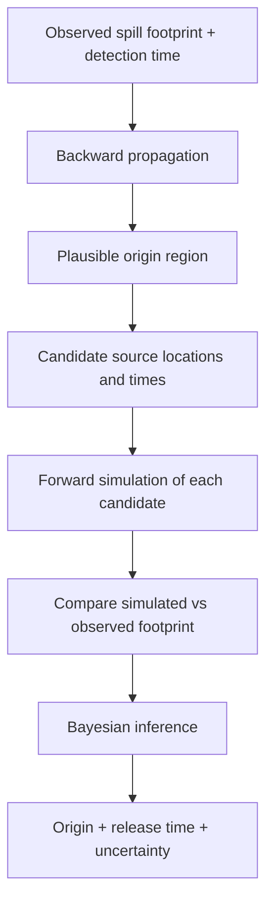
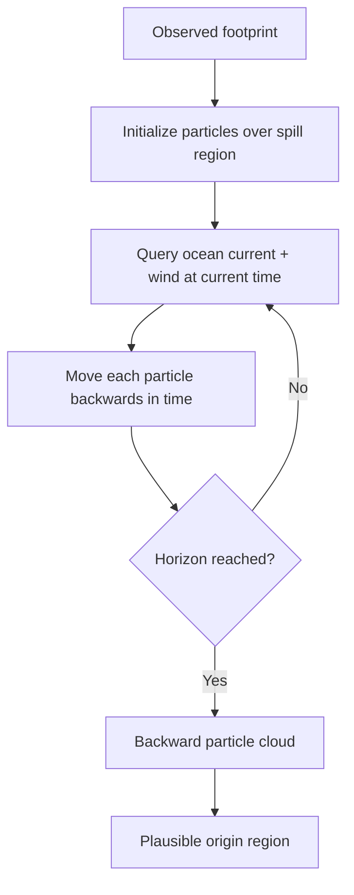
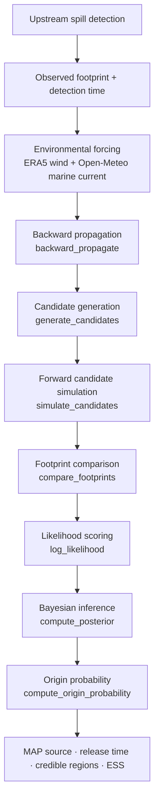
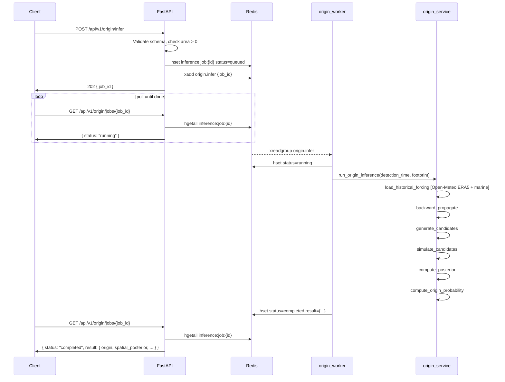

# Aqua-Sentinel: Backward Propagation / Origin Inference

**Internal team reference — drift-forecast service**

---

## 1. What this feature does

The upstream detection system provides an oil spill footprint and a timestamp. This module estimates:

- **Where** the spill most likely originated
- **When** it was released
- **How uncertain** that estimate is

That is the scope of this module. It is not vessel identification, AIS attribution, severity scoring, or spill detection. Those live elsewhere. This module receives the footprint and finds the probable source.

---

## 2. The core idea

> "We see oil *here* at time *T*. Where could it have come from?"

The spill drifted from its release point to the observed location under the influence of wind and ocean current. To recover the source we run the process in reverse — statistically:

1. Move particles *backwards* from the observation to find the plausible origin region.
2. Generate a set of candidate sources from that region.
3. Run each candidate *forward* through the oil-spill model.
4. Compare each candidate's simulated footprint against what was actually observed.
5. Weight the candidates by how well they explain the observation — that is Bayesian inference.



---

## 3. Why backward propagation?

If every point in the ocean were tested as a potential source, the search space would be enormous. Backward propagation narrows it.

Particles are placed at the observed spill and driven backwards through the wind and current field. After running back over the configured horizon, the particle cloud marks the region of plausible origins. Candidates are only generated from inside that region.

> **Backward propagation does not give the final answer. It identifies where it makes sense to look.**

Some physical processes — Fay spreading, Fickian diffusion, weathering — are stochastic or irreversible. Reversing them would not be physically meaningful. So backward advection is used purely as a search-space narrowing tool. The forward model then properly evaluates each candidate.



---

## 4. Complete pipeline



| Stage | Function / file |
|---|---|
| Environmental forcing | `load_historical_forcing()` — `forcing_loader.py` |
| Backward propagation | `backward_propagate()` — `backward_hindcast.py` |
| Candidate generation | `generate_candidates()` — `candidate_generation.py` |
| Forward simulation | `simulate_candidates()` — `forward_adapter.py` |
| Footprint comparison | `compare_footprints()` — `footprint_comparison.py` |
| Likelihood | `log_likelihood()` — `observation_likelihood.py` |
| Bayesian inference | `compute_posterior()` — `bayesian_inference.py` |
| Origin probability | `compute_origin_probability()` — `origin_probability.py` |

---

## 5. Inputs

The API accepts only observational inputs. All scientific parameters are frozen server-side.

```json
POST /api/v1/origin/infer

{
  "detection_time": "2020-08-10T01:37:55Z",
  "observed_footprint": {
    "type": "Polygon",
    "coordinates": [[
      [57.71, -20.41],
      [57.73, -20.41],
      [57.73, -20.40],
      [57.71, -20.40],
      [57.71, -20.41]
    ]]
  }
}
```

Both `Polygon` and `MultiPolygon` (GeoJSON) are accepted. The request schema rejects any extra fields — including `backward_horizon_hours` or `n_candidates` — with HTTP 422.

The upstream detection system is responsible for producing the footprint. Origin inference only consumes `detection_time` and `observed_footprint`.

---

## 6. Environmental forcing

Origin inference requires wind and ocean-current data for the 96-hour window ending at `detection_time`. Because origin requests can refer to past detection times — potentially years in the past — the forcing must come from a historical archive, not a live data store.

The forcing is obtained through:

```
origin_service.py
    → load_historical_forcing()   [forcing_loader.py]
        → ERA5 wind archive       [archive-api.open-meteo.com/v1/archive]
        → Open-Meteo Marine API   [marine-api.open-meteo.com/v1/marine]
        → forcing_series list
    → backward_propagate()
```

**Wind:** ERA5 reanalysis blend, hourly resolution, available back to 1940. Variables: `wind_speed_10m` (m/s) and `wind_direction_10m` (meteorological FROM convention, degrees).

**Ocean current:** Open-Meteo Marine API, hourly, available from approximately 2022 onwards for most ocean regions. Variables: `ocean_current_velocity` (km/h, converted to m/s) and `ocean_current_direction`. When the marine API returns no data for the requested location and period — for example, some regions before 2022 — the loader substitutes zero current and processing continues with wind-only forcing.

The output of `load_historical_forcing()` is a `forcing_series` list. Each element has exactly five fields:

```python
{
    "t":                datetime,   # UTC-aware
    "wind_speed_ms":    float,      # m/s
    "wind_dir_deg":     float,      # meteorological FROM, degrees
    "current_speed_ms": float,      # m/s
    "current_dir_deg":  float,      # meteorological FROM, degrees
}
```

This is the standard schema consumed by the existing particle physics throughout the service. Nothing downstream of `load_historical_forcing()` is aware of the data source.

---

## 7. Backward propagation

### Initialization

Particles are initialized over the observed spill region using the same radius formula as the forward model. The initial spread radius is `max(MIN_RADIUS_M, sqrt(observed_area_m2 / π))`, where `MIN_RADIUS_M = 500 m`. Particles are distributed uniformly at random within this disk centred on the observed centroid.

### Per-step physics

At each integration step (600 s), the uniform forcing at time `t_current` is interpolated from `forcing_series` using linear interpolation between hourly samples. Each particle experiences the same forcing (single-point, not spatially varying).

The effective displacement at each step is:

```
Δlat = -(current_north + windage × wind_north) × dt / m_lat
Δlon = -(current_east  + windage × wind_east ) × dt / m_lon
```

The sign is negated — particles move *backward* in time.

Windage is sampled per particle from the range [1 %, 4 %] of wind speed, matching the forward model's parameterization. Windage coefficients are periodically resampled every `WINDAGE_RESAMPLE_INTERVAL_S` (900 s).

**Diffusion is not reversed.** Fickian diffusion is stochastic and irreversible. Adding random noise to backward steps would not recover the physical forward diffusion and is explicitly excluded.

### Horizon

The backward integration runs for `HORIZON_HOURS = 96.0` hours. This is a frozen server-side parameter and cannot be overridden by the client.

### Output

Every integration step records the full particle cloud state: position array, centroid, and RMS spread. The complete `trajectory_history` list is what `generate_candidates()` uses to build the origin estimate.

**Function:** `backward_propagate()` in `backward_hindcast.py`  
**Returns:** `BackwardEnsembleResult` containing `trajectory_history`, `final_particles`, `final_centroid`, and `uncertainty_metrics`.

---

## 8. Candidate generation

The backward trajectory history contains many thousands of (lat, lon, elapsed_time_back) states — one per particle per time step. These are the candidate space. Rather than testing all of them individually, a structured sampling is performed:

1. All trajectory states are collected as 3D points: (lat, lon, elapsed_hours_back).
2. The coordinates are scaled to unit variance and a 3D Gaussian KDE is fitted.
3. `N_CANDIDATES = 100` candidates are sampled from that KDE.
4. Near-duplicate candidates (within 1 km spatially, 600 s temporally) are removed.
5. Each candidate stores a `proposal_density` — the KDE value at that point — which is needed later for importance sampling weight correction.

Each candidate represents a source hypothesis:

```python
CandidateSourceHypothesis:
    source_lat:        float    # WGS-84 degrees
    source_lon:        float    # WGS-84 degrees
    release_time:      datetime # UTC, snapped to 600 s grid
    proposal_density:  float    # KDE value q(θ) — not a probability
    backward_support:  float    # fraction of backward particles within 5 km
```

**Function:** `generate_candidates()` in `candidate_generation.py`  
**Input:** `BackwardEnsembleResult` from backward propagation  
**Output:** `CandidateGenerationResult` containing the candidate list

---

## 9. Forward simulation

For every candidate the question is: *if the spill really started here at this time, where would the oil end up?*

Each candidate is run through the existing `simulate_ensemble()` forward model (`particles.py`). The same `forcing_series` used in backward propagation is also used here — each candidate simulation receives the identical forcing time series. The simulation runs forward from `candidate.release_time` to `detection_time` and produces a predicted spill centroid, area, and (where available) polygon.

```
Candidate source + release time
         ↓
forcing_series  (same series as backward propagation)
         ↓
simulate_ensemble()  [particles.py — unchanged]
         ↓
Predicted centroid, area, polygon
         ↓
compare_footprints()
         ↓
FootprintComparisonResult
```

`simulate_ensemble()` is called unchanged. The forward adapter (`forward_adapter.py`) wraps it, validates forcing coverage, and passes `horizons_h=[duration_hours]` where `duration_hours = (detection_time - release_time).total_seconds() / 3600`.

**Function:** `simulate_candidates()` in `forward_adapter.py`  
**Input:** candidate list, `forcing_series`, `ObservedSpill`  
**Output:** `List[CandidateSimulationResult]`

---

## 10. Footprint comparison

Each forward simulation produces a predicted footprint. It is compared against the observation using `compare_footprints()` in `footprint_comparison.py`.

| Field | Description | Used by likelihood |
|---|---|---|
| `delta_lon_m` | Centroid offset east-west (m) | **Yes** — 2D Gaussian centroid term |
| `delta_lat_m` | Centroid offset north-south (m) | **Yes** — 2D Gaussian centroid term |
| `observed_area_m2` | Observed spill area | **Yes** — log-normal area term |
| `simulated_area_m2` | Simulated spill area | **Yes** — log-normal area term |
| `centroid_distance_m` | Haversine centroid distance | Diagnostic only |
| `area_difference_m2` | Absolute area difference | Diagnostic only |
| `relative_area_error` | (sim − obs) / obs | Diagnostic only |
| `iou` | Intersection-over-union | Only if `use_iou=True` (default off) |
| `hausdorff_distance_m` | Max polygon vertex distance | Diagnostic only |

The comparison metrics are raw physical quantities — not probabilities. The likelihood function converts them into a score in the next stage.

---

## 11. Likelihood and Bayesian inference

### Likelihood model

The v1 observation model assumes conditional independence between centroid and area errors.

**Centroid term** — 2D isotropic Gaussian:
```
dx ~ N(0, σ_c²),   dy ~ N(0, σ_c²),   independent
log L_centroid = −0.5 × (dx² + dy²) / σ_c²  −  log(2π σ_c²)
```
where `dx = delta_lon_m`, `dy = delta_lat_m`, and `σ_c = SIGMA_CENTROID_M = 5000 m`.

**Area term** — log-normal:
```
r_A = log(A_sim / A_obs)
r_A ~ N(0, σ_A²)
log L_area = −0.5 × (r_A / σ_A)²  −  log(√(2π) σ_A)
```
where `σ_A = SIGMA_AREA_LOG = 1.0`.

**Combined:**
```
log L(y | θ) = log L_centroid + log L_area
```

### Importance sampling

The prior over candidates is uniform (`log_prior = 0`). The posterior weight of each candidate is:

```
log_weight = log_likelihood(candidate) + log_prior − log_proposal(candidate)
           = log_likelihood(candidate) − log(KDE density at candidate)
```

The `log_proposal` term corrects for the fact that candidates were sampled non-uniformly from the KDE — it ensures the posterior is not biased toward densely sampled regions of the backward cloud.

Weights are exponentiated, then normalized to sum to 1. The candidate with the highest normalized weight is the MAP (Maximum A Posteriori) estimate.

If all candidates have zero weight (e.g. all forward simulations failed), equal weights are assigned and a `EQUAL_WEIGHT_FALLBACK` quality flag is set.

**Function:** `compute_posterior()` in `bayesian_inference.py`

---

## 12. Origin probability

The posterior over 100 candidates is summarized into interpretable spatial and temporal estimates.

### Spatial

| Field | Meaning |
|---|---|
| `map_lat`, `map_lon` | Location of the highest-weight candidate |
| `weighted_centroid_lat/lon` | Σ(weight × location) across all candidates |
| `weighted_rms_spread_m` | Effective spatial spread of the posterior |
| `credible_50` | Minimum candidate set covering 50 % of posterior weight (HPD subset) |
| `credible_90` | Minimum candidate set covering 90 % of posterior weight (HPD subset) |

Credible regions are discrete candidate subsets, not circles or ellipses. Each reports `n_candidates`, `spatial_extent_km`, and the full candidate list with weights.

### Temporal

| Field | Meaning |
|---|---|
| `map_release_time` | Release time of the MAP candidate |
| `weighted_mean_release_time` | Σ(weight × release_time) |
| `credible_50_lo/hi` | 25th / 75th weighted quantile of release time |
| `credible_90_lo/hi` | 5th / 95th weighted quantile of release time |
| `spread_hours` | Width of the 90 % interval in hours |

### Diagnostics

| Field | Meaning |
|---|---|
| `ess` | Effective sample size = 1 / Σ(wᵢ²) |
| `ess_ratio` | ESS / N_total |
| `max_posterior_weight` | Weight of the single highest-weight candidate |
| `quality_flags` | `LOW_ESS`, `DIFFUSE_SPATIAL_POSTERIOR`, `DIFFUSE_TEMPORAL_POSTERIOR`, etc. |
| `warnings` | Non-fatal issues encountered during inference |

A high-weight MAP candidate does not confirm the source. A diffuse posterior means the observation does not strongly distinguish between candidates under the current forcing and likelihood parameters.

**Function:** `compute_origin_probability()` in `origin_probability.py`  
**Returns:** `OriginProbabilityResult`

---

## 13. API flow

The inference pipeline takes minutes (ERA5 wind fetch alone makes ~100+ sequential HTTP calls). The API accepts the job immediately and returns a `job_id`. The client polls until completion.



**Why asynchronous?** Historical environmental forcing is fetched from Open-Meteo during job execution. Backward propagation and forward candidate simulation each add seconds to tens of seconds. Holding an HTTP connection open for the full duration is not viable, so the API submits the inference as an asynchronous job and returns a job ID for status polling.

**Job state lifecycle:** `queued` → `running` → `completed` or `failed`. Jobs expire from Redis after 24 hours.

---

## 14. Code map — production call chain

```
origin_api.py            POST /api/v1/origin/infer, GET /api/v1/origin/jobs/{id}
    └─ origin_worker.py  consume origin.infer stream, manage job lifecycle
        └─ origin_service.py        run_origin_inference()
            ├─ forcing_loader.py    load_historical_forcing()
            │   ├─ Open-Meteo ERA5 archive  (wind)
            │   └─ Open-Meteo Marine API    (current, zero fallback if unavailable)
            ├─ backward_hindcast.py         backward_propagate()
            │   └─ particles.py             _interp_forcing(), _wind_components()
            ├─ candidate_generation.py      generate_candidates()
            ├─ forward_adapter.py           simulate_candidates()
            │   ├─ particles.py             simulate_ensemble()
            │   └─ footprint_comparison.py  compare_footprints()
            ├─ observation_likelihood.py    log_likelihood()
            ├─ bayesian_inference.py        compute_posterior()
            └─ origin_probability.py        compute_origin_probability()
```

`schemas.py` defines `InferOriginRequest` (input validation) and all response Pydantic models.

---

## 15. Frozen server-side parameters

These are set in `origin_service.py`. Clients cannot override them via the request body — any extra field in the request is rejected with HTTP 422.

| Constant | Value | Meaning |
|---|---|---|
| `HORIZON_HOURS` | 96.0 | Backward advection horizon (hours) |
| `N_CANDIDATES` | 100 | Candidate source hypotheses generated |
| `N_PARTICLES_BWD` | 300 | Backward ensemble particle count |
| `N_PARTICLES_FWD` | 100 | Particles per forward candidate simulation |
| `SEED` | 42 | Global RNG seed for reproducibility |
| `SIGMA_CENTROID_M` | 5000.0 | Likelihood centroid uncertainty (metres) |
| `SIGMA_AREA_LOG` | 1.0 | Likelihood log-area uncertainty |
